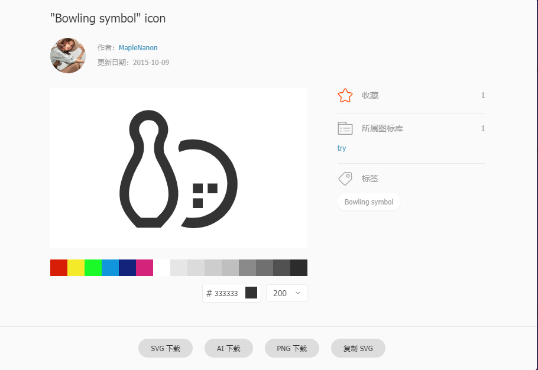
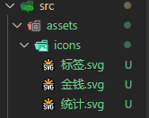
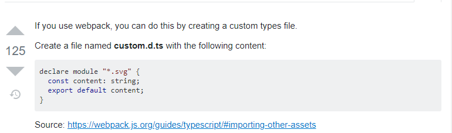
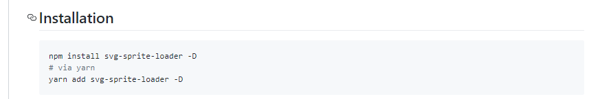
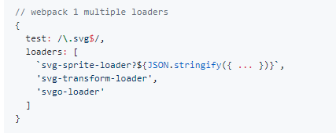
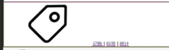

# Vue icons.svg的引入
如何以svg的方式在Vue中引入icons?
1. 下载icons.svg文件，推荐网址：https://www.iconfont.cn/ （阿里巴巴旗下的一个图标网站）

搜索自己想要的icons选择svg下载。

2. 引入项目中，在assets文件夹中创建一个icons文件夹，将文件引入。（svg文件的本质是XML）


3. 由于Vue中的ts无法搜索到这一模块，所以无法引入，因此启动Google（ctrl+C大法），搜索："typescript svg cannot find module".找到答案，抄。

该答案告诉我们应当创建一个custom.d.ts然后粘贴以下内容：
```
declare module "*.svg" {
  const content: string;
  export default content;
}
```
实际上，我们无需创建新文件，只需找到src文件夹下的shims-vue.d.ts,进行粘贴即可。

4. 此时仍无法实现效果，这时候我们就需要Google it。搜索：svg sprite loader，抄，安装。


5. 由于我们没有webpack.config.js,因此我们应按照Vue.cli的文档，将loader的一段内容进行翻译。



翻译完成后，黏贴至vue.config.js：
```js
const path = require('path')  //引入path模块，nodeJs的模块。

module.exports = {
  lintOnSave: false,
  chainWebpack: config =>{
    const dir = path.resolve(__dirname, 'src/assets/icons')  //首先，确认icons的目录

    config.module
      .rule('svg-sprite') //添加名为'svg-sprite'的规则
      .test(/\.svg$/) //文件如果能够符合这一规则'\.svg$'这是一正则表达式（以svg结尾），我就要使用它的规则。
      .include.add(dir).end() // 只包含 icons 目录
      .use('svg-sprite-loader').loader ('svg-sprite-loader').options({extract:false}).end()  //声明使用的loader，添加一个选项，extrac：false意为不要解析出文件。loader配置完毕。
    config.plugin('svg-sprite').use(require('svg-sprite-loader/plugin'), [{plainSprite: true}])
    config.module.rule('svg').exclude.add(dir) // 其他 svg loader 排除 icons 目录

  }
}
```
6. 引入成功后，就可以通过使用use标签进行引用。 
```js

<svg>
<use xlink:href=''/>

</svg>

```


效果：